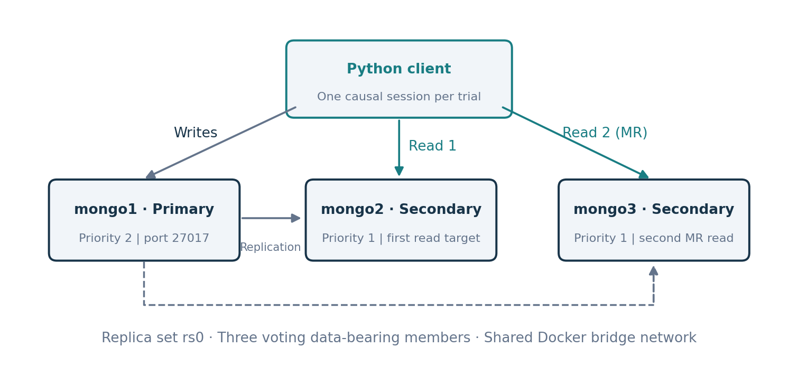
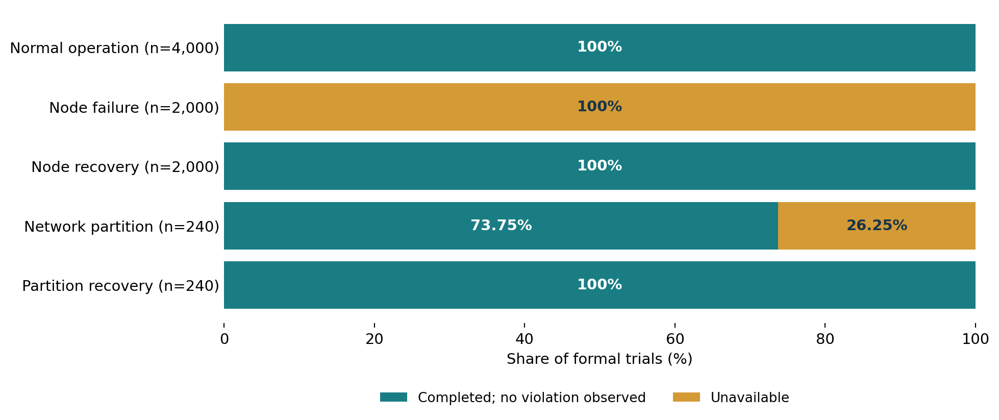

# Client-Centric Consistency in MongoDB

## Configuration 2: Majority Concerns and Causal Sessions

**DSA5208 · Experimental Report**

## Abstract

Configuration 2 combines majority read and write concerns, secondary reads, and explicit causal sessions in a three-node MongoDB replica set. Four client-centric consistency properties were tested under normal operation, node failure, and network partition. Of 8,480 formal trials, 6,417 completed without an observed violation and 2,063 were unavailable. All normal-operation and recovery checks completed without violations. Failures were associated with unavailable or ineligible read targets and three write-concern timeouts. The results support the predicted consistency properties for the tested sequences, while showing that successful replication does not ensure that every prescribed client operation can complete.

## 1. Deployment

MongoDB was selected for its configurable consistency settings, replicated storage, and automatic primary elections. Three containers form replica set `rs0` on the Docker bridge network `project1_mongo-net`. A Python client container shares this network. The deployment runs on one macOS host through Colima.

| Member | Initial role | Internal address | Host port | Priority |
|---|---|---|---:|---:|
| mongo1 | Primary | mongo1:27017 | 27017 | 2 |
| mongo2 | Secondary | mongo2:27017 | 27018 | 1 |
| mongo3 | Secondary | mongo3:27017 | 27019 | 1 |

Each member stores data and has one vote; there is no arbiter. The recorded versions are MongoDB **8.3.11**, client Python **3.12.14**, and PyMongo **4.16.0**. Host orchestration uses Python 3.9.6, and the database containers record Docker Compose 5.5.1. Exact macOS, Colima, and Docker Engine versions were not captured in the archived metadata. The floating image tag `mongo:8` resolved to the recorded server version; a later pull may differ.



*Figure 1. Initial topology. Writes follow the primary; tagged reads target mongo2 and, for the second MR read, mongo3. WFR also includes a primary-side dependency check.*

### Installation procedure

With the project files, Python, Docker, Docker Compose, and Colima installed, the deployment is prepared as follows:

```bash
cd ~/Desktop/project1
colima start --profile consistency-lab
export DOCKER_CONTEXT=colima-consistency-lab
python3 -m venv .venv
.venv/bin/python -m pip install -r requirements.txt

docker-compose -f compose.yaml up -d
.venv/bin/python setup_majority.py

docker-compose -f compose.yaml -f config2/compose.config2.yaml up -d --build client-config2
.venv/bin/python config2/setup_config2.py
```

The setup scripts initialize or validate `rs0`, assign member tags, verify roles, and check that a fresh majority-written marker is readable on all three nodes. The client connects through the replica-set URI:

```text
mongodb://mongo1:27017,mongo2:27017,mongo3:27017/?replicaSet=rs0
```

## 2. Configuration and Predictions

| Parameter | Setting |
|---|---|
| Write concern | `majority` |
| Read concern | `majority` |
| Read preference | `secondary` |
| Causal consistency | ON |
| Automatic read/write retries | OFF |

Majority writes request acknowledgment from a majority of voting data-bearing members. Majority reads return majority-committed data, but do not alone link a read to the client's preceding operation. [Write concern](https://www.mongodb.com/docs/manual/reference/write-concern/); [majority read concern](https://www.mongodb.com/docs/manual/reference/read-concern-majority/).

Each trial creates one explicit causal session from a replica-set `MongoClient`. Related operations execute sequentially with the same session argument. The first secondary read targets the tag for `mongo2`; the second MR read targets `mongo3`. There is no fallback when the tagged node is unavailable or becomes primary. [Read preference](https://www.mongodb.com/docs/manual/core/read-preference/).

MongoDB documents all four guarantees for causal sessions combining majority reads and majority writes. These guarantees concern successful operation sequences, not the availability of every request. [Causal consistency documentation](https://www.mongodb.com/docs/manual/core/causal-consistency-read-write-concerns/).

| Property | Predicted behavior |
|---|---|
| Read-your-writes (RYW) | A later read reflects the client's acknowledged write or a later state. |
| Monotonic reads (MR) | A later read does not return an earlier version than a preceding read. |
| Monotonic writes (MW) | Sequential writes preserve the client's write order. |
| Writes-follow-reads (WFR) | A dependent write respects the causal history of the preceding read. |

**Normal operation:** all four checks should complete without violations. **Node failure:** stopping `mongo2` removes a required read or observation target from every model, although majority writes may remain possible through the surviving pair. **Network partition:** isolating `mongo1` allows the remaining majority to elect a primary. If `mongo2` is elected, all models lose their designated first secondary target. If `mongo3` is elected, MR loses its second secondary target, while the other models can use `mongo2`. After recovery, successful checks should again satisfy the predicted properties.

## 3. Experimental Method

### Test design

Each trial uses a unique document identifier and a run-specific collection. Increasing integer versions make stale reads and reversed observations detectable. There is no concurrent application writer.

| Model | Procedure and criterion |
|---|---|
| RYW | Acknowledge W1, then read x from mongo2. A returned version below W1 violates RYW. |
| MR | Write W1, then read x from mongo2 and mongo3. A lower second version violates MR. |
| MW | Acknowledge W1 and W2 sequentially. Observe W2 on mongo2, check ten further reads for regression, and verify W1-before-W2 in the oplog. |
| WFR | Read x on mongo2, then write y containing the observed dependency version. Check x on the primary and secondary, observe y, and verify source-before-dependent oplog order. |

The version comparisons test visible ordering; oplog entries provide additional evidence about the identities and order of writes on the inspected member. Diagnostic oplog reads use separate direct clients and local read concern, outside the application session under test.

Normal trials verify the baseline on `mongo2`, and MR also verifies it on `mongo3`. Node-fault and node-recovery MR trials retain a baseline wait on `mongo3`; partition trials omit secondary baseline waits. These preparation differences limit direct comparisons between phases.

### Scenarios and measurements

| Phase | Trials per model | Total |
|---|---:|---:|
| Normal operation | 1,000 | 4,000 |
| Node failure | 500 | 2,000 |
| Node recovery | 500 | 2,000 |
| Network partition | 60 | 240 |
| Partition recovery | 60 | 240 |
| **Total** | | **8,480** |

Node failure is introduced with `docker stop mongo2`. The partition disconnects `mongo1` from the project network, cutting its replication and client path. Faults are introduced before their measurement phase. Recovery restores connectivity and expected roles, verifies a new majority-written marker on all members, and waits two seconds before measurement. Cleanup uses `try/finally` blocks.

Server selection and connection timeouts are 30 seconds during normal testing and 500 milliseconds during fault/recovery testing. Read execution and write-concern limits are two seconds; the socket timeout is four seconds. These limits apply to different stages rather than defining one total request deadline.

Results are classified as **no violation observed**, **violation**, **unavailable** when a necessary operation fails, or **inconclusive** when evidence is insufficient. A write timeout does not prove that the write was not applied. Sixty preflight trials are excluded from the formal totals.

## 4. Results

### Overall outcomes

| Phase | Trials | No violation observed | Violations | Unavailable |
|---|---:|---:|---:|---:|
| Normal operation | 4,000 | 4,000 | 0 | 0 |
| Node failure | 2,000 | 0 | 0 | 2,000 |
| Node recovery | 2,000 | 2,000 | 0 | 0 |
| Network partition | 240 | 177 | 0 | 63 |
| Partition recovery | 240 | 240 | 0 | 0 |
| **Total** | **8,480** | **6,417** | **0** | **2,063** |

No trial was classified as inconclusive. During normal operation, each model completed 1,000 trials without an observed violation. Each model also completed all 500 node-recovery trials and all 60 partition-recovery trials without violations.



*Figure 2. Outcome proportions within each phase. Sample sizes differ; unavailable trials are not successful consistency checks.*

### Node failure

Each model recorded 500 unavailable trials while `mongo2` was stopped. All 2,000 exceptions were `ServerSelectionTimeoutError`: 1,500 occurred at the first application read and 500 at the MW observation of W2. These failures reflect the missing designated read path, not reversed writes or stale returned values.

### Network partition

The surviving pair elected `mongo3` as primary, while `mongo2` remained secondary.

| Model | Trials | No violation observed | Unavailable | Failure stage |
|---|---:|---:|---:|---|
| RYW | 60 | 57 | 3 | Two baseline writes; one W1 |
| MR | 60 | 0 | 60 | Second read from mongo3 |
| MW | 60 | 60 | 0 | None |
| WFR | 60 | 60 | 0 | None |

The three RYW failures raised `WTimeoutError`. All MR trials reached their second read but could not select `mongo3` as a secondary after its election. MW and WFR completed through the surviving primary and `mongo2`. Recorded writes targeted `mongo3`, confirming that the majority side continued to accept writes.

After reconnection and recovery checks, all 240 trials completed without violations. The final recorded topology was `mongo1` primary and `mongo2`/`mongo3` secondary, with all containers running on the project network.

### Evidence validation

The three formal audits passed. They checked all 8,480 trial classifications, 35,097 application read commands with causal lower bounds, and eight three-node recovery marker checks. The audit also verified majority concerns, session identifiers, tagged secondary routing, destinations, and source snapshot hashes. Read-command counts include preparation and observation reads and therefore exceed trial counts.

## 5. Discussion and Limitations

The completed checks agree with the consistency predictions. The fault outcomes also agree with the fixed-target routing design: a stopped secondary cannot serve its required reads, and an elected primary no longer qualifies as a tagged secondary. The three write-concern timeouts indicate unsuccessful acknowledgment within the configured limit; the records do not establish their precise underlying cause.

The principal distinction is between consistency and completion. The partition left a functioning majority, yet MR could not finish its prescribed two-secondary sequence. Allowing both reads to use the remaining secondary could change availability, but would constitute a different experiment. The 2,063 unavailable trials consequently cannot be counted as either successful checks or consistency violations.

Several limitations constrain the conclusions:

- **Shared host and limited faults:** containers share one virtual machine. The tests cover one stopped secondary and isolation of the initial primary, not multiple simultaneous failures or arbitrary mid-session faults.
- **Restricted workload:** operations are sequential, without a competing writer or forced replication delay. MR and WFR follow a write by the same session and therefore explore a limited set of causal histories.
- **Bounded evidence:** MW and WFR inspect one secondary over finite observation windows. Trials within a run are not independent repetitions of the full fault experiment.
- **Measurement conditions:** fixed tags, short timeouts, and phase-specific preparation affect completion. The study does not establish production availability, latency, or throughput.
- **Reproducibility:** some host software versions were not archived. Original logs and source snapshots are retained, including their historical identifiers, without altering measured observations.

Zero observed violations supports the predictions for these runs; it does not prove correctness under every possible execution.

## 6. Conclusion

Configuration 2 preserved the tested consistency predicates in all 6,417 completed checks. The remaining 2,063 trials were unavailable, mainly because their prescribed read targets were stopped or no longer secondary. All recovery checks completed without violations. The results demonstrate that causal consistency and majority replication can coexist with unavailable client sequences when routing constraints cannot be satisfied.

## References

1. MongoDB. [Causal Consistency and Read and Write Concerns](https://www.mongodb.com/docs/manual/core/causal-consistency-read-write-concerns/).
2. MongoDB. [Read Preference](https://www.mongodb.com/docs/manual/core/read-preference/).
3. MongoDB. [Read Concern “majority”](https://www.mongodb.com/docs/manual/reference/read-concern-majority/).
4. MongoDB. [Write Concern](https://www.mongodb.com/docs/manual/reference/write-concern/).
5. Phongthecoder. [mongo-consistency](https://github.com/Phongthecoder/mongo-consistency), base deployment and experiment structure.

*MongoDB documentation accessed 25 September 2026.*

## Reproduction and Data

Settings are defined in `config2.py`. After deployment, run the three scenarios sequentially from the `config2/` directory:

```bash
../.venv/bin/python normal_config2_experiment.py
../.venv/bin/python node_failure_config2_experiment.py
../.venv/bin/python network_partition_config2_experiment.py
../.venv/bin/python audit_config2.py results_config2/<run-directory>
```

Formal records are stored under `results_config2/`:

- Normal: `20260923T083607Z-normal-formal-7d0a6c`
- Node failure/recovery: `20260923T083624Z-node-formal-6164b0`
- Partition/recovery: `20260923T090231Z-partition-formal-fae952`

Each directory contains the manifest, source snapshots, operation history, summaries, audit, and database logs. `config2_audit_summary.json` provides the combined audit. The renaming record and unmodified pre-rename backup preserve the relationship between current file names and historical evidence.
