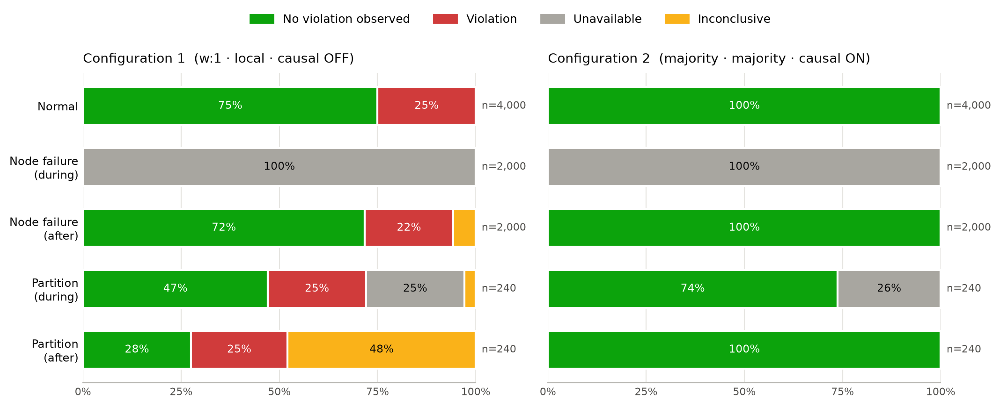

# 1. Introduction

A replicated database keeps several copies of each item. Its consistency settings decide how far those copies may diverge, and what a client can observe when its operations reach different copies. This project investigates how MongoDB's tunable settings (write concern, read concern, read preference and causal consistency) affect four *client-centric* (session) consistency models:

- **Read-your-writes (RYW):** a read reflects every write the same client performed earlier.
- **Monotonic reads (MR):** successive reads by a client never return an older state than an earlier read did.
- **Monotonic writes (MW):** a client's writes are applied everywhere in the order the client issued them.
- **Writes-follow-reads (WFR):** a write that follows a read is ordered after the writes whose effects that read observed.

These guarantees were introduced by Terry et al. [1] for weakly consistent replicated data. They describe what one client sees, not what the system looks like globally.

We tested two configurations at opposite ends of MongoDB's tuning range:

- **Configuration 1**: write concern `w: 1`, read concern `local`, reads from secondaries, and no causal session.
- **Configuration 2**: write concern `majority`, read concern `majority`, reads from secondaries, and one causal session per trial.

Each configuration was tested under **normal operation**, **failure of a secondary node** and a **network partition that isolates the primary**. For each scenario we first predicted whether each model would hold and justified the prediction. We then ran the experiment, reported the results and compared them with the predictions.

# 2. Database, deployment and installation

## 2.1 Choice of database

We chose MongoDB because its consistency behaviour can be tuned per operation. Write concern controls how many replica-set members must acknowledge a write. Read concern controls which committed state a read may return. Read preference controls which member serves a read. Causally consistent client sessions add ordering guarantees across the operations of one session [2]–[6]. A MongoDB replica set also performs automatic elections, so node failures and partitions produce the failover behaviour we wanted to study [7].

## 2.2 Deployment architecture

The database is a three-member replica set, `rs0`, running as Docker containers on one machine (Figure 1). Every member stores data and has one vote; there is no arbiter. `mongo1` has priority 2, so it is the preferred primary and takes the primary role back after it recovers. `mongo2` and `mongo3` have priority 1.

| Member | Initial role | Address inside Docker | Host port | Priority | Member tag |
|---|---|---|---:|---:|---|
| mongo1 | Primary | `mongo1:27017` | 27017 | 2 | `node: mongo1` |
| mongo2 | Secondary ("Secondary 1") | `mongo2:27017` | 27018 | 1 | `node: mongo2` |
| mongo3 | Secondary ("Secondary 2") | `mongo3:27017` | 27019 | 1 | `node: mongo3` |


The test client runs **inside a client container** on the same Docker bridge network as the database (`mongo-net`). It uses a single replica-set connection:

```text
mongodb://mongo1:27017,mongo2:27017,mongo3:27017/?replicaSet=rs0
```

With this connection, the driver discovers the members, sends writes to whichever member is currently primary, and routes reads by read preference. Reads target a specific secondary through member tags: `Secondary(tag_sets=[{"node": "mongo2"}])` for Read 1 and `{"node": "mongo3"}` for Read 2. There is no fallback, so if the tagged member is down or has become primary, that read fails. Keeping the read targets fixed keeps the experiment controlled.

A **launcher script** on the host starts each experiment. It copies the code into the client container, starts a worker there with `docker exec`, and sends it one trial at a time. The launcher also injects the faults, which must be done from outside the container: `docker stop mongo2` for a node failure, and `docker network disconnect` of `mongo1` for a partition. It then restores the cluster afterwards.

Both configurations use the same client image, connection, routing, test functions and fault procedure. Only the settings in `config1.py` and `config2.py` differ.

## 2.3 Software versions

| Component | Configuration 1 runs | Configuration 2 runs |
|---|---|---|
| MongoDB server (image `mongo:8`) | 8.3.11 | 8.3.11 |
| Client container | Python 3.12.14, PyMongo 4.16.0 | Python 3.12.14, PyMongo 4.16.0 |
| Host operating system | macOS 26.6.2 (Apple M5, 10 CPUs) | macOS (version not recorded) |
| Container runtime | Docker Desktop, Docker Engine 29.8.0 | Colima (version not recorded) |
| Docker Compose | 5.5.1 | 5.5.1 |
| Host launcher | Python 3.12.14, PyMongo 4.18.1 | Python 3.9.6 |
| Date of formal runs | 26 September 2026 | 23 September 2026 |

The two configurations were run by different group members on different Macs. The server and client software was identical; the host hardware and container runtime were not (see Section 8).

## 2.4 Installation procedure

The prerequisites are Docker with Docker Compose, Python 3.9 or later, and free host ports 27017–27019. From the repository root:

```bash
# 1. Host Python environment
python3 -m venv .venv
.venv/bin/python -m pip install -r requirements.txt

# 2. Start the three MongoDB containers and initialize the replica set
docker-compose -f compose.yaml up -d
.venv/bin/python setup_majority.py

# 3. Build and start each configuration's client container, then add member tags
docker-compose -f compose.yaml -f config1/compose.config1.yaml up -d --build client-config1
.venv/bin/python config1/setup_config1.py
docker-compose -f compose.yaml -f config2/compose.config2.yaml up -d --build client-config2
.venv/bin/python config2/setup_config2.py
```

`compose.yaml` runs each member as `mongod --replSet rs0 --bind_ip_all`. `setup_majority.py` calls `replSetInitiate` with the three members and priorities 2/1/1 if the set does not exist yet. It then waits until `mongo1` is PRIMARY and both others are SECONDARY, and records the replica-set configuration and versions. `setup_configN.py` adds the `node` tags with `replSetReconfig`, checks that the cluster is healthy, and checks that a new majority-written marker can be read back from all three members. Section 9 lists the commands that run the experiments.

# 3. Consistency configurations explored

## 3.1 Tunable parameters in MongoDB

| Parameter | Options (selection) | Effect |
|---|---|---|
| Write concern `w` [2] | `0`, `1`, a number *n*, `"majority"` | How many members must acknowledge a write before the client gets success. `w: 1` needs only the primary; `majority` needs a majority of voting data-bearing members (2 of 3 here). |
| Read concern [3] | `local`, `available`, `majority`, `linearizable`, `snapshot` | Which data a read may return. `local` returns the member's latest data, which may not be majority-committed and may later be rolled back [8]. `majority` returns only data acknowledged by a majority. |
| Read preference [5] | `primary`, `primaryPreferred`, `secondary`, `secondaryPreferred`, `nearest`, plus tag sets | Which member serves a read. Secondaries replicate asynchronously from the primary's oplog [9], so a secondary may lag. |
| Causal consistency [6] | client session with `causal_consistency=True` or no session | In a causal session, each operation carries the session's latest `operationTime` as `afterClusterTime`. A member does not answer until its data is at least that recent. |

MongoDB documents that a causally consistent session provides all four client-centric guarantees when reads use `majority` read concern and writes use `majority` write concern. It also documents that weaker combinations do not guarantee them, particularly across failures and elections [6].

## 3.2 Chosen configurations

| Setting | Configuration 1 | Configuration 2 |
|---|---|---|
| Write concern | `w: 1` | `w: "majority"` (`wtimeout` 2 s) |
| Read concern | `local` | `majority` |
| Read preference | `secondary` (tagged) | `secondary` (tagged) |
| Causal consistency | OFF (no explicit session) | ON (one causal session per trial) |
| Automatic read/write retries | OFF | OFF |

Configuration 1 is the fastest and weakest combination: a write is acknowledged as soon as the primary has it, and a secondary read returns whatever that member currently holds. Configuration 2 is the combination MongoDB documents as causally consistent. Every other setting was held constant, including the secondary read preference that exposes replication lag. Differences between the two runs can therefore be attributed to write concern, read concern and sessions.

# 4. Experimental design (common to both configurations)

## 4.1 Test procedures

Every trial writes to its own fresh document IDs (`<phase>-<model>-<trial>:x` and `:y`) in a collection unique to the run. Stale data from earlier trials therefore cannot be mistaken for the current trial's data. Versions are increasing integers: trial *i* writes a baseline version 3*i*, then W1 = 3*i*+1 and, for MW, W2 = 3*i*+2. A stale read is then easy to detect. Each trial is:

1. **Baseline write** of version 3*i* to the primary. In the normal phase the harness waits until `mongo2` has the baseline, and for MR also `mongo3`. In the node-failure phases it waits only for MR's baseline on `mongo3`. In the partition phases it does not wait.
2. **W1**: write version 3*i*+1 to the primary and wait for the acknowledgement.
3. The model-specific check:

| Model | Operations after W1 | Classified as a violation if |
|---|---|---|
| RYW | R1: read x from `mongo2` | R1 returns a version older than W1, or no document |
| MR | R1: read x from `mongo2`, then R2: read x from `mongo3` | R2 returns an older version than R1 |
| MW | W2 (version 3*i*+2); observe W2 on `mongo2` (up to 1 s), then 10 more reads of x on `mongo2`; read the oplog entries of W1 and W2 on `mongo2` | any later read returns a version older than W2, or `mongo2`'s oplog has W2 before W1 |
| WFR | R1: read x from `mongo2`; write y = {`based_on_version`: version read}; read x on the primary; wait for y on `mongo2` and read x there; read the oplog entries of the source write and of y on `mongo2` | x on the primary or on `mongo2` is older than the version R1 read, or the dependent write y precedes its source in the oplog |

In Configuration 2 all application operations of a trial use the same causal session. In Configuration 1 there is no session. Oplog reads are diagnostic only and use separate direct connections. They are not part of the application's operations.

## 4.2 Scenarios and fault injection

| Scenario | Fault | Phases measured | Trials per model per phase | Trials |
|---|---|---|---:|---:|
| Normal operation | none | normal | 1,000 | 4,000 |
| Node failure | `docker stop mongo2` (Secondary 1) | during failure; after recovery | 500 | 4,000 |
| Network partition | `docker network disconnect` of `mongo1` (the primary) from `mongo-net` | during partition; after recovery | 60 | 480 |
| **Total per configuration** | | | | **8,480** |

- **Node failure:** stopping `mongo2` shuts its process down, so connections to it are refused.
- **Network partition:** disconnecting `mongo1` isolates it from the other members and from the client. `mongo1` keeps running, but it can no longer reach a majority and steps down. The remaining two members elect a new primary [7], and the launcher waits until this is confirmed before measuring.
- **Faults and recovery:** each fault is injected before its measurement phase begins. Recovery restarts or reconnects the member and waits until `mongo1` is PRIMARY (through its priority) and the others are SECONDARY. It then checks that a new majority-written marker is readable on all three members, and waits two more seconds before the after-recovery phase.
- **Cleanup:** runs in `try/finally` blocks, so the cluster is restored even if a run fails.

**Timeouts:**
- Server selection and connection timeouts are 30 s in normal operation and 500 ms during fault and recovery phases, so that a trial against an unreachable node fails quickly.
- Reads use `maxTimeMS` 2 s and the socket timeout is 4 s.
- A `--smoke` option runs 3 trials per model per phase as a preflight check; smoke runs are excluded from the results.

## 4.3 Outcome classification

- **No violation observed:** every required operation succeeded and the check held.
- **Violation:** every required operation succeeded and the check failed.
- **Unavailable:** a required operation raised an error, for example because its target member was down or not a secondary. This is not a consistency violation. It means the prescribed sequence could not complete.
- **Inconclusive:** the operations succeeded but did not produce enough evidence, for example because R1 returned *no document* in MR or WFR, so there was no version to compare.

A trial with no observed violation supports a prediction but does not prove a guarantee. A single violation does refute a claim that the property is guaranteed.

## 4.4 Evidence and audit

Each run directory contains:

- a manifest with the settings and SHA-256 hashes of the source files;
- a copy of the source code;
- a JSON history of every trial, with each operation's value, error, target member, timing and the driver's wire-level commands;
- summaries and the database logs.

An independent audit script (`audit_configN.py`) replays the history and checks four things. First, the wire commands carried the configured concerns, and in Configuration 2 the same session with a valid `afterClusterTime`. Second, every write reached the recorded primary and every tagged read reached a secondary. Third, every classification follows from the recorded values. Fourth, the cluster was fully recovered. All six formal runs (three per configuration) passed their audits.

## 4.5 Design rationale

- **Secondary reads expose replication lag.** Reading from secondaries rather than the primary is what makes the client-centric guarantees non-trivial: with primary reads, RYW and MR would hold almost automatically in a stable cluster.
- **Fixed targets keep each check the same.** Tagged targets ensure every trial tests the same pair of members. When a member is unavailable, the trial reports that rather than silently switching to another member.
- **The fault targets were chosen for specific effects.**
  - Stopping `mongo2`, the member that every model reads from, shows whether an unavailable read path produces stale data or errors.
  - Isolating the primary forces an election, a change of write path, and later a second election when `mongo1` takes the primary role back.
- **Sample sizes follow the cost of a trial.** 1,000 trials per model in normal operation make rare violations (below 1%) observable. Partition phases use 60 trials because each partition trial is costly and the partition window is short.

# 5. Configuration 1: `w: 1`, read concern `local`, causal consistency OFF

## 5.1 Description and set-up

Configuration 1 favours latency and availability over consistency.

- **`w: 1`:** the primary acknowledges a write as soon as it has applied it locally, before any secondary has replicated it [2].
- **Read concern `local`:** a secondary answers from whatever it has applied so far [3], [4].
- **No causal session:** reads carry no `afterClusterTime`, so a secondary never waits to catch up with the client's earlier writes [6].

The settings are defined in `config1/config1.py`:

```python
CONFIG = {'writeConcern': 1, 'readConcern': 'local', 'readPreference': 'secondary',
          'causalConsistency': False, 'replicaSet': 'rs0',
          'retryReads': False, 'retryWrites': False}

def create_collections(client, name):
    write_collection = client[DB_NAME][name].with_options(
        write_concern=WriteConcern(w=1),
        read_concern=ReadConcern('local'), read_preference=Primary())
    read_collection_1 = write_collection.with_options(
        read_preference=Secondary(tag_sets=[{'node': 'mongo2'}]))
    read_collection_2 = write_collection.with_options(
        read_preference=Secondary(tag_sets=[{'node': 'mongo3'}]))
    return write_collection, read_collection_1, read_collection_2

def trial_session(client):
    return None   # causal consistency OFF: no explicit session
```

The client container `client-config1` was built and tagged with `setup_config1.py` as described in Section 2.4. The three scenarios were then run one after another on 26 September 2026: normal, node failure, network partition. Each was audited afterwards.

Predictions were written down before the formal runs (`config1/config1_plan.md`). An earlier version of Configuration 1 connected directly to each member from the host (Section 5.5). It had already shown RYW violations, which informed the RYW prediction.

## 5.2 Normal operation

### Predictions and justification

| Model | Prediction | Justification |
|---|---|---|
| RYW | **Violations expected (frequent)** | R1 is sent to `mongo2` right after W1 is acknowledged. With `w: 1` that acknowledgement means only that the primary has W1. `mongo2` fetches it asynchronously from the primary's oplog [9], and with no `afterClusterTime` it answers immediately, possibly with the baseline. The rate depends on how the client's round trip compares with replication delay. |
| MR | **Not guaranteed; violations expected to be rare** | A violation needs `mongo2` to have W1 when R1 arrives, and `mongo3` not to have it when R2 arrives slightly later. Both secondaries fetch the same oplog from the same primary at similar speed, and R2 is always later than R1, so this should rarely happen. Nothing in the configuration prevents it. |
| MW | **Expected to hold** | Both writes go to the one primary. W2 is sent only after W1 is acknowledged, so the primary applies and logs them in that order. Secondaries apply the oplog in order, so no member should show W2 and then W1. With `w: 1` this could fail only if W1 were rolled back after a failover [8], which cannot happen in normal operation. |
| WFR | **Expected to hold** | In a stable cluster, a secondary only has writes the primary already made. So whatever R1 saw is already on the primary, and y is logged after it. When `mongo2` has replicated y, it has also replicated everything before y in the oplog. |

### Experiment set-up

4 × 1,000 trials, all members healthy. The harness waited for the baseline on `mongo2` (and for MR also on `mongo3`) before W1, so every trial started from a known state. Server-selection timeout was 30 s.

### Results

| Model | Trials | No violation observed | Violation | Unavailable | Inconclusive | Violation rate |
|---|---:|---:|---:|---:|---:|---:|
| RYW | 1,000 | 2 | 998 | 0 | 0 | 99.80% |
| MR | 1,000 | 998 | 2 | 0 | 0 | 0.20% |
| MW | 1,000 | 1,000 | 0 | 0 | 0 | 0.00% |
| WFR | 1,000 | 1,000 | 0 | 0 | 0 | 0.00% |

- **RYW:** in all 998 violating trials, R1 returned the trial's baseline, the version immediately before W1. The median duration was 0.12 ms for W1 and 0.13 ms for R1, so the read typically arrived at `mongo2` before W1 had been replicated there.
- **MR:** both violations had the same shape. R1 on `mongo2` already returned W1 (for example version 364), while R2 on `mongo3` still returned the baseline (363).
- **MW and WFR:** every check passed, including the oplog-order checks on `mongo2`.

### Comparison with the predictions

All four predictions were confirmed.

- **RYW:** this was the clearest result. When the client is close to the database, as here on one Docker network, an acknowledged `w: 1` write is almost never visible yet on a secondary.
- **MR:** it was violated, as the configuration allows, but only rarely, because the two secondaries lag by similar amounts.
- **MW and WFR:** they held in every trial. With one primary ordering all writes, the oplog preserves both properties without any help from a session.

This is consistent with the analysis above. It does not show that `w: 1` guarantees MW and WFR in general.

## 5.3 Node failure (Secondary 1, `mongo2`, stopped)

### Predictions and justification

| Model | During failure | After recovery | Justification |
|---|---|---|---|
| RYW | **Unavailable** | Violations expected (possibly more than normal) | R1 must be served by tagged `mongo2`, and there is no fallback. Writes still succeed because `w: 1` needs only `mongo1`. After restart, `mongo2` must first apply the oplog entries it missed, adding to the usual replication delay. |
| MR | **Unavailable** | Rare violations at most | R1 cannot be served, so the sequence stops before R2. |
| MW | **Unavailable** | Hold | Both writes succeed, but W2 cannot be observed on `mongo2`. |
| WFR | **Unavailable** | Hold | The initial read on `mongo2` cannot be served. |

After recovery, the node-failure phases do not wait for the baseline on `mongo2` before W1. We therefore also expected some reads that return *no document*: a violation for RYW, and inconclusive for MR and WFR.

### Experiment set-up

The launcher stopped `mongo2` with `docker stop` and confirmed the roles `mongo1` PRIMARY, `mongo2` UNREACHABLE, `mongo3` SECONDARY. It then ran 4 × 500 trials with 500 ms server selection. Next it restarted `mongo2`, waited for the healthy roles and the three-member marker, waited 2 s, and ran 4 × 500 trials again.

### Results

| Phase | Model | No violation observed | Violation | Unavailable | Inconclusive |
|---|---|---:|---:|---:|---:|
| During failure | RYW | 0 | 0 | 500 | 0 |
| During failure | MR | 0 | 0 | 500 | 0 |
| During failure | MW | 0 | 0 | 500 | 0 |
| During failure | WFR | 0 | 0 | 500 | 0 |
| After recovery | RYW | 50 | 450 | 0 | 0 |
| After recovery | MR | 500 | 0 | 0 | 0 |
| After recovery | MW | 500 | 0 | 0 | 0 |
| After recovery | WFR | 385 | 0 | 0 | 115 |

**During the failure:**
- All 2,000 trials failed with `ServerSelectionTimeoutError` when they needed `mongo2`: 1,500 at R1 (RYW, MR, WFR) and 500 at the MW observation step.
- Every W1 was acknowledged by `mongo1`. The write path stayed available.

**After recovery:**
- RYW was violated in 450 of 500 trials (90.0%). In 335 of those, R1 returned the baseline. In 115 it returned no document: `mongo2` did not yet have even the trial's baseline write.
- The same lag made 115 WFR trials inconclusive. R1 returned no document, so there was no version for the dependent write to follow.
- MR, MW and every completed WFR check held.

### Comparison with the predictions

- **During the failure:** confirmed. With fixed read targets, a failed secondary makes every model unavailable rather than inconsistent. No stale data was returned from elsewhere.
- **After recovery:** also confirmed. RYW violations continued, and reads that return no document appeared as predicted. The RYW rate (90.0%) is not directly comparable with the normal rate (99.8%), because the after-recovery phase has no baseline wait. Some reads therefore returned no document rather than the baseline, and both count as violations.
- **Not predicted:** the number of inconclusive WFR trials (23%). It shows how far `mongo2` was still behind in the first seconds after recovery.

## 5.4 Network partition (primary `mongo1` isolated)

### Predictions and justification

When `mongo1` is disconnected, it loses contact with the majority and steps down. `mongo2` and `mongo3` hold an election, and with `w: 1` the client writes to the new primary. What can complete depends on which member wins, because the read targets are fixed:

| Model | During partition if `mongo3` becomes primary | … if `mongo2` becomes primary | After recovery | Justification |
|---|---|---|---|---|
| RYW | **Violations expected** | Unavailable | Violations expected | `mongo2` is still a secondary of the new primary, and the normal-operation lag applies. The partition phase has no baseline wait, so R1 may return no document. |
| MR | **Unavailable** (R2 needs `mongo3` as a secondary) | Unavailable | Rare violations or inconclusive | The tagged target for R2 is now the primary and is not eligible for a secondary read. |
| MW | **Hold** | Unavailable | Hold | The new primary orders both writes, and `mongo2` replicates from it in oplog order. |
| WFR | **Hold** (some inconclusive) | Unavailable | Hold (some inconclusive) | Same reasoning as normal operation. An R1 that returns no document gives nothing to depend on. |

In principle, `w: 1` has a further risk under a partition. An isolated old primary can acknowledge writes that are later rolled back [8]. That risk is not exercised here, because the client cannot reach the isolated `mongo1`.

### Experiment set-up

The launcher disconnected `mongo1` from `mongo-net` and waited until a new primary was elected. About 10 s later it recorded the roles `mongo1` UNREACHABLE, `mongo2` SECONDARY, `mongo3` PRIMARY. It then ran 4 × 60 trials. After that it reconnected `mongo1`, waited for it to take the primary role back (priority 2) and for the three-member marker, waited 2 s, and ran 4 × 60 trials again.

### Results

`mongo3` was elected primary. All 593 acknowledged application writes during the partition went to `mongo3`: 240 baseline, 240 W1, 60 W2 and 53 dependent writes.

| Phase | Model | No violation observed | Violation | Unavailable | Inconclusive |
|---|---|---:|---:|---:|---:|
| During partition | RYW | 0 | 60 | 0 | 0 |
| During partition | MR | 0 | 0 | 60 | 0 |
| During partition | MW | 60 | 0 | 0 | 0 |
| During partition | WFR | 53 | 0 | 0 | 7 |
| After recovery | RYW | 1 | 59 | 0 | 0 |
| After recovery | MR | 2 | 0 | 0 | 58 |
| After recovery | MW | 60 | 0 | 0 | 0 |
| After recovery | WFR | 3 | 0 | 0 | 57 |

**During the partition:**
- RYW was violated in every trial. 57 reads returned the baseline and 3 returned no document.
- All 60 MR trials completed R1 on `mongo2` but could not perform R2, because `mongo3` was now primary (`ServerSelectionTimeoutError`).
- MW held in all 60 trials.
- WFR held in 53 trials; in the other 7, R1 returned no document.

**After recovery:**
- `mongo1` took the primary role back.
- RYW was violated in 59 of 60 trials. 58 of those reads returned no document.
- The same lag made 58 MR and 57 WFR trials inconclusive.
- MW held in all trials, and every completed MR and WFR check held.

### Comparison with the predictions

- **During the partition:** the `mongo3`-elected branch of the prediction was confirmed exactly.
  - Writes continued through the new primary, so the partition did not stop the client.
  - RYW was violated, MR was unavailable because of its fixed target, and MW and WFR held.
- **After recovery:** also as predicted, but with stronger lag than expected. The primary changed twice in quick succession: `mongo3` took over, then `mongo1` took the role back. As a result, `mongo2` usually had not received even the trial's baseline by the time it was read. That left most MR and WFR checks inconclusive rather than tested.

## 5.5 Summary and limitations of Configuration 1

| Model | Normal | Node failure (during / after) | Partition (during / after) |
|---|---:|---:|---:|
| RYW | 99.80% | 100% unavailable / 90.00% | 100.00% / 98.33% |
| MR | 0.20% | 100% unavailable / 0.00% | 100% unavailable / 0.00% (96.7% inconclusive) |
| MW | 0.00% | 100% unavailable / 0.00% | 0.00% / 0.00% |
| WFR | 0.00% | 100% unavailable / 0.00% (23.0% inconclusive) | 0.00% (11.7% inconclusive) / 0.00% (95.0% inconclusive) |

*Violation rates, except where marked unavailable or inconclusive. Across all 8,480 trials: 4,614 no violation observed, 1,569 violations, 2,060 unavailable, 237 inconclusive. The audit verified `w: 1` on every application write, read concern `local` without `afterClusterTime` on all 41,662 application reads, and the routing of every operation.*

**Earlier direct-connection version.** An earlier version of Configuration 1 ran on the host with three separate direct connections, one to each member through its published port. It measured a normal-operation RYW violation rate of 29.1%, and 100% unavailability during the partition, because its writes were fixed to `mongo1`. That version is archived in `config1/archive_direct_connection/`. The comparison shows two things:

- The RYW violation rate depends on how long the read takes to reach the secondary. Docker's port forwarding on the host is slower than traffic between containers, which gave replication more time.
- Failover behaviour depends on the client's connection mode, not on the consistency settings.

We therefore rebuilt Configuration 1 on the same client as Configuration 2 before comparing the two.

**Limitations specific to Configuration 1:**

- **Rates depend on timing, not only on the configuration.** Violation rates are a property of this host and its replication delay. A different machine or network could give different percentages, although it would not change which properties can fail.
- **Phase-to-phase comparison is limited.** Only the normal phase waits for the baseline on the secondaries. After-recovery phases therefore mix "returned the baseline" with "returned no document". Their RYW rates, and their inconclusive MR/WFR trials, cannot be compared directly with the normal phase.
- **Inconclusive trials leave MR and WFR untested.** After the partition, 58 MR and 57 WFR trials never reached their check, so those phases say little about MR and WFR.
- **The rollback risk of `w: 1` was not tested.** The isolated primary was unreachable by the client, so no write was acknowledged and later rolled back. A partition that leaves the client connected to the old primary would be needed to observe a lost write.

# 6. Configuration 2: `majority` write and read concern, causal consistency ON

## 6.1 Description and set-up

Configuration 2 uses the combination MongoDB documents as causally consistent [6]:

- **Write concern `majority`:** a write is acknowledged once 2 of the 3 members have it, with `wtimeout` 2 s [2].
- **Read concern `majority`:** a read returns only data a majority has acknowledged, which cannot be rolled back [3], [8].
- **One causal session per trial:** every operation of a trial passes the same `ClientSession(causal_consistency=True)`. Each read therefore carries `afterClusterTime` equal to the session's latest operation time, and the secondary waits until it has caught up to that point before answering [6].

```python
def create_collections(client, name):
    write_collection = client[DB_NAME][name].with_options(
        write_concern=WriteConcern(w='majority', wtimeout=2000),
        read_concern=ReadConcern('majority'), read_preference=Primary())
    read_collection_1 = write_collection.with_options(
        read_preference=Secondary(tag_sets=[{'node': 'mongo2'}]))
    read_collection_2 = write_collection.with_options(
        read_preference=Secondary(tag_sets=[{'node': 'mongo3'}]))
    return write_collection, read_collection_1, read_collection_2

def causal_session(client):
    return client.start_session(causal_consistency=True)
```

The formal runs were made on 23 September 2026 on a group member's Mac using Colima, with client container `client-config2`. The predictions were recorded beforehand in `config2/config2_plan.md`. The numbers below come from that run's archived run directories and audits.

## 6.2 Normal operation

### Predictions and justification

| Model | Prediction | Justification |
|---|---|---|
| RYW | **Hold** | After W1 is acknowledged, the session's operation time is at least W1's. R1 sends `afterClusterTime` ≥ W1, so `mongo2` must wait until its majority-committed data includes W1 before answering. |
| MR | **Hold** | After R1, the session's time is at least the point R1 read at. R2 on `mongo3` therefore cannot return an earlier majority-committed state. |
| MW | **Hold** | Majority writes in one session are applied in session order, and are durable across failover [6], [8]. |
| WFR | **Hold** | The dependent write carries the session's causal time, which already includes what R1 observed, so it is ordered after its source. |

### Experiment set-up

Same as Section 5.2: 4 × 1,000 trials with baseline waits and 30 s selection timeout. Every application operation in a trial used the trial's causal session.

### Results

| Model | Trials | No violation observed | Violation | Unavailable | Inconclusive |
|---|---:|---:|---:|---:|---:|
| RYW | 1,000 | 1,000 | 0 | 0 | 0 |
| MR | 1,000 | 1,000 | 0 | 0 | 0 |
| MW | 1,000 | 1,000 | 0 | 0 | 0 |
| WFR | 1,000 | 1,000 | 0 | 0 | 0 |

### Comparison with the predictions

All four predictions were confirmed, with no violations. RYW is the key contrast with Configuration 1. The same R1 on the same member after the same W1 was violated in 99.8% of trials without a causal session, and in 0% with one. Here the audit checked that every one of the 35,097 application reads carried `afterClusterTime` no earlier than the session's latest operation time, which is the mechanism that makes the secondary wait.

## 6.3 Node failure (Secondary 1, `mongo2`, stopped)

### Predictions and justification

| Model | During failure | After recovery | Justification |
|---|---|---|---|
| RYW, MR, WFR | **Unavailable** | Hold | Each needs a read from tagged `mongo2`, and there is no fallback. Majority writes still succeed because `mongo1` and `mongo3` form a majority. |
| MW | **Unavailable** | Hold | W1 and W2 can be acknowledged, but W2 cannot be observed on `mongo2`. |

After recovery, causal reads on the recovered `mongo2` should wait until it has caught up, rather than return stale data.

### Experiment set-up

Same procedure as Section 5.3: 4 × 500 trials during the failure and 4 × 500 after recovery.

### Results

| Phase | Model | No violation observed | Violation | Unavailable | Inconclusive |
|---|---|---:|---:|---:|---:|
| During failure | each of RYW, MR, MW, WFR | 0 | 0 | 500 | 0 |
| After recovery | each of RYW, MR, MW, WFR | 500 | 0 | 0 | 0 |

All 2,000 unavailable trials failed with `ServerSelectionTimeoutError`: 1,500 at R1 and 500 at the MW observation step. This is the same breakdown as Configuration 1.

### Comparison with the predictions

Confirmed in both phases. The contrast with Configuration 1 is in the after-recovery phase: 2,000 of 2,000 checks held with no violation, while Configuration 1 had 450 RYW violations and 115 inconclusive WFR trials in the same phase. When a recovered secondary is behind, a causal read waits for it to catch up instead of returning stale or missing data.

## 6.4 Network partition (primary `mongo1` isolated)

### Predictions and justification

The two remaining members form a majority, so majority writes can continue through the new primary. Availability depends on the election, exactly as for Configuration 1. If `mongo3` wins, RYW, MW and WFR can complete through `mongo2`, and MR cannot perform R2. If `mongo2` wins, no model can complete. Every completed check should hold. Majority writes should not be lost: an acknowledged majority write is on a majority of members and survives the election [8].

### Experiment set-up

Same procedure as Section 5.4: 4 × 60 trials during the partition and 4 × 60 after recovery.

### Results

`mongo3` was elected primary, and every application write targeted `mongo3`.

| Phase | Model | No violation observed | Violation | Unavailable | Inconclusive |
|---|---|---:|---:|---:|---:|
| During partition | RYW | 57 | 0 | 3 | 0 |
| During partition | MR | 0 | 0 | 60 | 0 |
| During partition | MW | 60 | 0 | 0 | 0 |
| During partition | WFR | 60 | 0 | 0 | 0 |
| After recovery | each of RYW, MR, MW, WFR | 60 | 0 | 0 | 0 |

- **RYW:** the three unavailable trials were write-concern timeouts (`WTimeoutError`), two at the baseline write and one at W1. With only two members left, a majority write needs both of them to acknowledge within 2 s.
- **MR:** all 60 trials failed at R2, because `mongo3` was the primary.

### Comparison with the predictions

Confirmed. Every completed check held. Unavailability followed the fixed read targets, as predicted for a `mongo3` election. Unlike Configuration 1, the recovery phase had no violations or inconclusive trials: all 240 checks completed and held.

**Not predicted:** the three write-concern timeouts. They show the availability cost of `majority` with only two surviving members, since any slowdown of the second member delays acknowledgement. The records do not establish why those three writes were slow.

## 6.5 Summary and limitations of Configuration 2

Across all 8,480 trials: 6,417 no violation observed, **0 violations**, 2,063 unavailable, 0 inconclusive. All three audits passed.

**Limitations specific to Configuration 2:**

- **The run was on a different host.** The formal runs were made by another group member on a different Mac with Colima. The host OS and runtime versions were not recorded, and the full run directories are kept on that machine. The numbers in this report come from its audited summaries.
- **The cause of the three timeouts is unknown.** We cannot tell whether they came from network disruption, election timing or host load.
- **MR could not be tested during the partition.** This is a consequence of the fixed read targets, not of the configuration. Letting both reads use the remaining secondary would be a different experiment.
- **Zero violations supports the guarantee but does not prove it.** It shows the guarantee held for these sequential, single-client schedules. It is not a proof for concurrent clients or for faults that occur in the middle of a session.

# 7. Comparison of the two configurations



| Model | Configuration 1: violations | Configuration 2: violations |
|---|---|---|
| RYW | 998/1,000 normal; 450/500 after node recovery; 60/60 during partition; 59/60 after partition | 0 in every phase |
| MR | 2/1,000 normal; none otherwise (58 inconclusive after partition) | 0 in every phase |
| MW | 0 in every phase | 0 in every phase |
| WFR | 0 in every phase (179 inconclusive in total) | 0 in every phase |

**Do the observations agree with our expectations?** Yes, in every scenario.

- **RYW and MR separate the two configurations.**
  - Without a causal session and with `w: 1`/`local`, a secondary read right after a write almost always misses it. This happened 99.8% of the time in normal operation and even more around failures.
  - Occasionally a later read also sees older data than an earlier one (MR, 0.2%).
  - With majority concerns in a causal session, the secondary waits until it has caught up, and none of Configuration 2's 6,417 completed checks was violated.
- **MW and WFR held in both configurations.** In our single-client tests, all writes pass through one primary at a time, and replication applies the oplog in order. That ordering is enough to preserve MW and WFR even without a causal session. The difference would appear only in situations our tests did not create: for example, a `w: 1` write rolled back after failover, or a read from a member that is ahead of the primary the dependent write goes to. MongoDB documents exactly these as the cases where weaker concerns lose the guarantees [6], [8].
- **Availability was determined by routing, not consistency settings.**
  - Both configurations were 100% unavailable with `mongo2` stopped, because every model needs `mongo2`.
  - Both lost MR during the partition, because R2's target became primary.
  - Configuration 2 paid a small additional availability cost: 3 majority-write timeouts with only two members left.
  - Configuration 1 instead "paid" with inconclusive trials, reads that returned no document at all.
- **Recovery behaviour differs sharply.** After both faults, Configuration 1 showed its worst staleness: reads that returned no document and 90–98% RYW violations. Configuration 2 showed none. Causal consistency matters most in the moments after a fault, when replicas are furthest behind.

The trade-off is the classic one. Configuration 1 acknowledges writes and answers reads immediately, but gives the client almost no guarantee about its own earlier writes. Configuration 2 gives all four guarantees for every completed sequence, at the cost of waiting for replication and of a few timeouts when only two members remain.

# 8. Overall limitations

- **Single host.** All members and the client share one physical machine and one container runtime. Network delay is far lower than in a real multi-machine deployment, and violation rates are specific to that environment.
- **Different machines for the two configurations.** The server and client software, test code and procedure were identical, but the two configurations ran on different Macs (Docker Desktop vs. Colima) on different days. Differences in rates, such as timing effects, could partly reflect the host. The qualitative contrast (≈100% vs. 0% RYW violations) is far too large to be explained that way.
- **Sequential, single-client workload.** There were no concurrent clients, no competing writers and no artificially slowed replication. MW and WFR were only tested in histories where one primary ordered all writes.
- **Fault timing and scope.** Faults were injected between phases, not in the middle of a trial. Only one fault type was tested per scenario: one stopped secondary, or an isolated primary. Double failures, a partition that leaves the client talking to the old primary, and clock or disk faults were not tested.
- **Fixed read targets.** Tagged routing makes the checks comparable but decides availability. With a less strict read preference, such as `secondaryPreferred` or `nearest`, both availability and the chance of stale reads would change.
- **Finite evidence.**
  - The MW and WFR checks inspect one secondary over bounded windows.
  - Partition phases have only 60 trials per model.
  - Trials within a run are not independent repetitions of the fault.
  - "No violation observed" is supporting evidence, not proof.
- **Asymmetric preparation.** Baseline waits differ between phases (Section 4.1), so rates are comparable across configurations within a phase, but only loosely across phases.

# 9. Conclusion

With `w: 1`, read concern `local` and no causal session (Configuration 1), MongoDB violated read-your-writes in almost every trial, and occasionally monotonic reads, in normal operation. Staleness was worst right after node recovery and after partition healing. Monotonic writes and writes-follow-reads held in our tests only because a single primary orders all writes. With majority write and read concern in a causal session (Configuration 2), all four client-centric guarantees held in every completed check, including right after failures, as MongoDB's documentation states. In both configurations, node failures and partitions showed up as unavailable operations, determined by which member each read was required to use, rather than as inconsistent results.

# Reproducing the experiments

The code, run instructions and results are in the project repository (`README.md` at the root). After the installation steps in Section 2.4, run each scenario from inside the configuration's folder (`config1/` or `config2/`, replacing `N`):

```bash
cd configN
../.venv/bin/python normal_configN_experiment.py            # add --smoke for a 3-trial preflight
../.venv/bin/python node_failure_configN_experiment.py
../.venv/bin/python network_partition_configN_experiment.py
../.venv/bin/python audit_configN.py results_configN/<run-directory>
```

Each run writes its evidence directory to `results_configN/`. Formal runs also write the counts to `*_configN_results.json`.

# References

[1] D. B. Terry, A. J. Demers, K. Petersen, M. J. Spreitzer, M. M. Theimer and B. B. Welch, "Session Guarantees for Weakly Consistent Replicated Data," in *Proc. 3rd Int. Conf. on Parallel and Distributed Information Systems (PDIS)*, 1994, pp. 140–149.

[2] MongoDB, "Write Concern." <https://www.mongodb.com/docs/manual/reference/write-concern/>

[3] MongoDB, "Read Concern." <https://www.mongodb.com/docs/manual/reference/read-concern/>

[4] MongoDB, "Read Concern "local"." <https://www.mongodb.com/docs/manual/reference/read-concern-local/>

[5] MongoDB, "Read Preference." <https://www.mongodb.com/docs/manual/core/read-preference/>

[6] MongoDB, "Causal Consistency and Read and Write Concerns." <https://www.mongodb.com/docs/manual/core/causal-consistency-read-write-concerns/>

[7] MongoDB, "Replica Set Elections." <https://www.mongodb.com/docs/manual/core/replica-set-elections/>

[8] MongoDB, "Rollbacks During Replica Set Failover." <https://www.mongodb.com/docs/manual/core/replica-set-rollbacks/>

[9] MongoDB, "Replica Set Data Synchronization." <https://www.mongodb.com/docs/manual/core/replica-set-sync/>

[10] MongoDB, "Read Concern "majority"." <https://www.mongodb.com/docs/manual/reference/read-concern-majority/>

MongoDB documentation accessed September 2026.

# AI usage

- **Configuration 2:** OpenAI Codex assisted with:
  - implementing the Configuration 2 harness;
  - run and audit the Configuration 2 experiments.
- **Configuration 1 and this report:** Claude Code (Anthropic) was used to:
  - port Configuration 1 onto the shared harness;
  - write the Configuration 1 predictions before the formal runs;
  - run and audit the Configuration 1 experiments;
  - produce the figures;
  - draft this report.

All reported numbers come from the recorded run directories and were checked by the audit scripts. The group reviewed the text and is responsible for its content.
